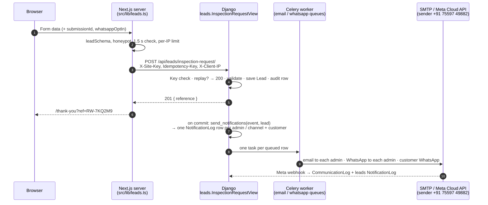
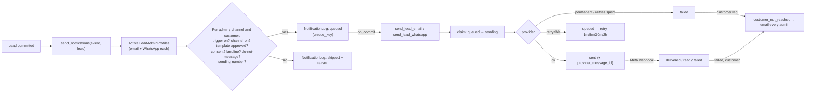

# API & Notification Architecture — Royal Waterproofing Co.

**What this covers:** the API the website calls, and the Email and WhatsApp notifications each enquiry sends.
**Status:** **implemented** in the ERP backend as the `leads` Django app (`construction-management-backend/apps/leads/`). It is built for **Royal Waterproofing Co. only**. It is not deployed yet: production needs the steps in [§5](#5-production-integration). The website side is done ([§5.5](#55-nextjs-integration)): it calls the API once `LEADS_API_URL` and `LEADS_API_KEY` are set.
**Last updated:** 6 October 2026

---

## Contents

0. [What was built](#0-what-was-built)
1. [Implemented API architecture](#1-implemented-api-architecture)
2. [WhatsApp template architecture](#2-whatsapp-template-architecture)
3. [Email template architecture](#3-email-template-architecture)
4. [Celery architecture](#4-celery-architecture)
5. [Production integration](#5-production-integration)
6. [Models](#6-models)
7. [Code map](#7-code-map)
8. [Still open](#8-still-open)

---

## 0. What was built

The website has one form that needs the API: the inspection request. "Get Free Inspection", "Request a Quote" and "Request a call back" all open it. After a lead is saved, Celery sends:

- an **email to every active admin profile**, at that admin's own address
- a **WhatsApp message to every active admin profile**, at that admin's own number
- a **WhatsApp confirmation to the customer** at the number they entered, only if `whatsappOptIn` is true. The website sends `true` for every enquiry and has no opt-in box ([§5.5](#55-nextjs-integration)).

Customers never get email. The chat assistant does not use this API.

### Design decisions

| Topic | Decision |
|---|---|
| Scope | One business: Royal Waterproofing Co. No per-business keys, senders, prefixes or labels. Leads are filed under the ERP business named by `LEADS_BUSINESS_SLUG`. |
| Website authentication | One shared secret, `LEADS_API_KEY`, set to the same value in Django and Next.js. It is compared in constant time, and an empty value refuses every request. |
| WhatsApp sender | Fixed: **+91 75597 49882**. It is the number the existing Meta integration (`WHATSAPP_PHONE_NUMBER_ID`) is connected to, confirmed against Meta on 6 Oct 2026 (verified name "Royal Waterproofing Co", quality GREEN). It is not a setting; the code only knows it so it never messages the sender itself. |
| Admin recipients | **`LeadAdminProfile` rows**, one per admin, each with its own **email address** and **WhatsApp number**. There can be any number. Every active profile gets every admin alert on both channels. Admins are added, edited and switched off in Django admin; no recipient is hard-coded. |
| Admin email | Django template files on the ERP's shared email theme (`base_email.html`), in Royal Waterproofing's brand blue ([§3](#3-email-template-architecture)) |
| WhatsApp wording | At Meta. `WhatsAppTemplate` rows hold the template name, parameter order and approval status ([§2](#2-whatsapp-template-architecture)). |
| Webhook | The **existing** webhook (`/api/notifications/whatsapp/webhook/`) sends a signal that `leads` listens to. Meta allows one webhook URL per app. |
| Message log | `leads.NotificationLog` is the outbox: whether a message goes, to whom, sent once. The shared `notifications.CommunicationLog` is the wire record. They meet on `provider_message_id`. |
| Lead retention | **Kept indefinitely.** Nothing deletes or expires a lead. Only a superuser can delete one, in Django admin. `Lead.business` is `PROTECT`, so even deleting the business cannot remove leads. |

### Deliberately not built

| Item | Reason |
|---|---|
| Call-back time promises, call-back scheduling, urgent-leak escalation, emergency-call workflows, SLA or timer-based escalation | Out of scope by decision. No message promises a call-back time, and the template editor warns if wording does. |
| Automatic lead deletion or retention periods | Leads are kept until a superuser deletes one |
| API 3 — photo uploads | The website has `features.photoUploads = false`, and the backend has no object storage yet ([§1.9](#19-api-3--photo-uploads-not-built)) |
| `inspection.booked` / `inspection.reminder` | They need an inspection-booking step that doesn't exist |
| An ERP (React) screen for leads | Staff use Django admin |
| Automatic submission of templates to Meta | Templates are created in Meta Business Manager ([§5.3](#53-whatsapp-template-approval)) |

### Known limitation

The shared WhatsApp client (`notifications.whatsapp.normalize_phone`) treats any 10-digit number as Indian. A customer with an international number of 10 digits or fewer *including* the country code (e.g. Singapore `+65 9123 4567`) is therefore **not** messaged. The log records "number format not supported", and the admin messages say "please call". Fixing it means changing the shared client that billing, payroll and attendance messages use, so it was left alone.

---

## 1. Implemented API architecture

### 1.1 Endpoints

| Method + URL | Purpose | Called by | Authentication |
|---|---|---|---|
| `POST /api/leads/inspection-request/` | Submit an inspection request | Next.js server only | `X-Site-Key` = `LEADS_API_KEY` |
| `GET /api/notifications/whatsapp/webhook/` | Meta's one-time subscription check (returns `hub.challenge`) | Meta | `hub.verify_token` = `WHATSAPP_WEBHOOK_VERIFY_TOKEN` |
| `POST /api/notifications/whatsapp/webhook/` | Delivery receipts, customer replies, template review results | Meta | `X-Hub-Signature-256` HMAC with `WHATSAPP_APP_SECRET`. Fails closed. |

There are no customer logins and no public read APIs. Staff work in Django admin at `/admin/`.

### 1.2 Authentication and permissions

| Who | Can do | How it is enforced |
|---|---|---|
| Website (Next.js server) | Create leads | `SiteKeyAuthentication` compares `X-Site-Key` with `settings.LEADS_API_KEY` (`hmac.compare_digest`). It returns **401** for a missing or wrong key, an empty `LEADS_API_KEY`, or a `LEADS_BUSINESS_SLUG` that names no active business. `request.auth` is that business, and leads are saved under it. |
| Meta | Webhook | Signature check in the existing `WhatsAppWebhookView`. Without `WHATSAPP_APP_SECRET`, every POST gets 403. |
| Staff: lead handlers | View and update leads; view message logs | Django group **Lead handlers** (`view_lead`, `change_lead`, `view_notificationlog`) |
| Staff: notification admins | Add, edit and deactivate **admin profiles**; edit WhatsApp templates and triggers; sync with Meta; resend; manage the do-not-message list | Django group **Notification admins** |
| Superuser | Everything, including **deleting a lead** (the only way a lead is ever removed) | `is_superuser` |

Both groups are created by `setup_lead_notifications`. Staff also need `is_staff = True`. In Django admin, a staff member who is not a superuser sees lead data only if their ERP account belongs to Royal Waterproofing's business. The ERP is multi-tenant, so this stops any other tenant's staff from ever seeing leads.

### 1.3 Request

**Headers**

| Header | Required | Rule | Missing or invalid |
|---|---|---|---|
| `X-Site-Key` | Yes | Equal to `LEADS_API_KEY` | 401 |
| `Idempotency-Key` | Yes | 8–64 characters of `A–Z a–z 0–9 _ -`. Use a UUID generated once per form. | 400 `{"errors": {"Idempotency-Key": [...]}}` |
| `X-Client-IP` | Yes | The visitor's IPv4/IPv6 address | 400 `{"errors": {"X-Client-IP": [...]}}` |
| `Content-Type` | Yes | `application/json` | 400/415 from DRF |

**Body** (example)

```json
{
  "name": "Priya Sharma",
  "phone": "98200 12345",
  "service": "bathroom-waterproofing",
  "serviceName": "Bathroom Waterproofing",
  "area": "other",
  "areaName": "Other",
  "areaOther": "Mira Road",
  "propertyType": "apartment",
  "email": "priya@example.com",
  "message": "Damp patch on the ceiling below our bathroom, worse since the monsoon.",
  "preferredDate": "2026-10-10",
  "timeWindow": "morning",
  "contactMethod": "whatsapp",
  "whatsappOptIn": true,
  "sourcePage": "/services/bathroom-waterproofing",
  "formLocation": "service-bathroom-waterproofing-cta",
  "attribution": { "utm_source": "google", "utm_medium": "cpc", "utm_campaign": "monsoon-2026" },
  "photoCount": 0
}
```

The short form may send only `name`, `phone`, `service` and `area`, plus `areaOther` when the area is `other`. Unknown fields such as `website` and `elapsedMs` are ignored.

### 1.4 Validation

The rules and messages match `leadSchema` in the website's `src/lib/validation.ts` word for word, so an error from Django reads the same as one from the browser. Keys are the website's camelCase field names. That departs from the ERP's usual snake_case on purpose, because the form puts each error under the field with the same name.

| Field | Rule | Message |
|---|---|---|
| `name` | 2–80 characters after trimming | "Please enter your name." / "Please keep your name under 80 characters." |
| `phone` | Required | "Please enter a phone number so we can call you back." |
| | Only digits, spaces, `-`, `(`, `)`, `.` and a leading `+` | "Use digits only — spaces, dashes and a leading + are fine." |
| | **Indian:** 10 digits starting 2–9, optionally written with `+91`, `91` or a leading `0`. **International:** starts with `+` (not `+91`), 8–15 digits | "Enter a 10-digit mobile number, or add your country code if you're outside India." |
| `service` | Required, max 80 | "Choose the service you need, or “Not sure”." |
| `area` | Required, max 80 | "Choose your area, or “Other”." |
| `areaOther` | Required when `area` is `other`; max 80 | "Tell us which area you're in." / "Please keep this under 80 characters." |
| `email` | Empty or a valid address (stored lower-case) | "Please enter a valid email address, or leave it blank." |
| `propertyType` | Empty or `apartment`, `society`, `house`, `commercial`, `industrial`, `new-build` | "Choose a property type." |
| `message` | Max 1,500 | "Please keep this under 1,500 characters." |
| `preferredDate` | Empty or `YYYY-MM-DD`, no earlier than yesterday (India time) | "Please choose today or a later date." |
| `timeWindow` | Empty or `morning`, `afternoon`, `evening` | "Choose one of the options." |
| `contactMethod` | Empty (→ `call`), `call` or `whatsapp` | "Choose one of the options." |
| `whatsappOptIn` | Boolean, default `false` | — |
| `photoCount` | 0–5, default 0 | "Up to 5 photos." |
| `serviceName`, `areaName` | Text, kept up to 120 characters | — |
| `sourcePage` / `formLocation` | Text, kept up to 200 / 80 characters | — |
| `attribution` | Only `utm_source`, `utm_medium`, `utm_campaign`, `utm_term`, `utm_content`, `landing_page`, `referrer` are kept; values cut to 200. Tracking data never fails a lead. | — |

**Set by Django:** `reference`, `status`, `phone_e164` (e.g. `919820012345`), `phone_type` (`india_mobile`: starts 6–9; `india_landline`: starts 2–5; `international`), `whatsapp_opt_in_at`, `ip_address`, `duplicate_of` and `created_at`.

### 1.5 Responses and error handling

| Status | Body | When | What the website shows |
|---|---|---|---|
| **201** | `{"reference": "RW-7KQ2M9", "message": "Thank you. We'll call you back to understand the problem and fix a visit time."}` | Lead saved | Thank-you page with the reference |
| **200** | Same body, **same reference** | `Idempotency-Key` already used. Nothing is saved or sent again, and the body is not re-validated. | Thank-you page |
| **400** | `{"errors": {"phone": ["…"], "areaOther": ["…"]}}` | Validation or header problem | Each message under its field |
| **401** | `{"detail": "…"}` | Key missing or wrong, `LEADS_API_KEY` unset, or lead capture not set up / switched off | Generic error box (a configuration bug, not a visitor error) |
| **429** | `{"detail": "Request was throttled. Expected available in N seconds."}` | More than `LEADS_RATE_LIMIT` (default `10/hour`) from one visitor IP | "You've sent a few requests already. Please call or WhatsApp us instead." |
| **500** | — | Anything else | "We couldn't send your request just now." with Call and WhatsApp buttons |

The reference is `RW-` plus 6 characters from `23456789ABCDEFGHJKLMNPQRSTUVWXYZ`. 0/O and 1/I are left out so it can be read over the phone. It matches the thank-you page's `RW-[A-Z0-9]{3,12}` and is unique. On the rare collision Django draws again, up to 5 times.

Notifications run **after** the row is committed. A slow or failing email or WhatsApp provider can never fail or slow the form.

### 1.6 Integration flow



What happens inside `create_inspection_request`:

1. Look for an enquiry from the same `phone_e164` inside `LEAD_DUPLICATE_WINDOW_MINUTES` (default 30). If one is found, link to the *first* enquiry (`duplicate_of`) and set `status = duplicate`.
2. Draw a reference and run `full_clean()`.
3. In one transaction, save the `Lead`, write an audit row `LEAD_CREATE` (system actor) and register an on-commit callback.
4. After the commit, call `send_notifications("lead.created" | "lead.repeat_enquiry", lead)`. The callback is `robust`, so an error there is logged and never turns the 201 into a 500.
5. If two requests race with the same `Idempotency-Key`, the unique constraint makes the loser return the winner's lead with 200.

### 1.7 Duplicate enquiries

| Situation | Django does |
|---|---|
| Same `Idempotency-Key` (a retry) | Returns the first result with 200. Saves nothing and sends nothing. |
| Same phone within 30 minutes (a new form) | Saves it as `duplicate` of the first lead and raises `lead.repeat_enquiry`, which goes to the admins only. The customer is not messaged twice. |

### 1.8 API 2 — WhatsApp webhook

Meta sends every callback to the existing `WhatsAppWebhookView`. That view verifies the signature, applies receipts to `CommunicationLog` (unchanged behaviour), then sends `notifications.signals.whatsapp_webhook_received` with `send_robust`. The `leads` receiver queues `leads.tasks.process_whatsapp_webhook` only when the body concerns leads: a receipt for a known `provider_message_id`, an inbound message, or a template review. The view always returns 200 once the signature is valid.

| Update from Meta | Lead-side action |
|---|---|
| `sent` / `delivered` / `read` | Advance the `NotificationLog` row, forward-only: a late `delivered` never demotes `read`. Sets `delivered_at` / `read_at`. |
| `failed` | Mark the row failed with Meta's code and reason. If it was the **customer** message, raise `notification.customer_not_reached`, which emails every admin "Couldn't reach … — please call". Code `131026` (not on WhatsApp) also adds the number to the do-not-message list. A redelivered `failed` changes nothing. |
| Customer replies `STOP` or `UNSUBSCRIBE` (any case) | Add the number to the do-not-message list, if it ever sent an enquiry. The sender number also carries ERP staff alerts, so a STOP from a staff member who never enquired is ignored here. |
| `message_template_status_update` | Update `meta_status` (and reason, Meta id) on the template with that name and language |

### 1.9 API 3 — photo uploads (not built)

The design stays as it was: `POST /api/leads/uploads/` returns pre-signed `putUrl`s, the browser uploads to object storage, and API 1 accepts `photoIds`. It needs object storage (S3 or similar, plus `django-storages`), which the backend doesn't have. `Lead.photo_count` and the "Photos" line in the email are already in place.

---

## 2. WhatsApp template architecture

### 2.1 How it works

- **Sender:** every message leaves from **+91 75597 49882** through the existing integration, `notifications.whatsapp.send_template`. That is the only Meta client in the ERP: it builds the components, strips line breaks, never sends an empty value and records the `CommunicationLog` row. `WHATSAPP_PHONE_NUMBER_ID` is that number's Meta id. `setup_lead_notifications` re-checks it read-only with `services.verify_whatsapp_sender()`.
- The **wording lives at Meta**. Django sends only the template name, the language and the values in order.
- Each `WhatsAppTemplate` row stores `meta_template_name`, `header_text`, `body_preview` (the body exactly as submitted to Meta), `footer_text`, `param_order` (the variable names behind `{{1}}`, `{{2}}`…), `button_param` (the variable for a dynamic URL button's suffix) and `meta_status`.
- **`param_order` is load-bearing.** If it doesn't match the approved body, real values land in the wrong slots. Two safeguards protect it. A save checks there is one name per numbered variable. "Sync with Meta" compares Meta's approved body with `body_preview`, and if they differ the template stays `draft` and is not sent.

### 2.2 Naming conventions

`rw_<audience>_<purpose>`: lower-case, `a–z 0–9 _` only (Meta's rule). `<audience>` is `admin` or `client`. Meta names cannot be changed once created, so a wording change keeps the name and re-enters review. A breaking change, such as different variables, gets a version suffix, e.g. `rw_client_enquiry_received_v2`.

### 2.3 Categories and types

All templates are **UTILITY** (a transactional reply to the customer's own request), language `en`, text header, text footer. The admin templates have one **dynamic URL button**; the customer template has none.

### 2.4 Dynamic variables

Variables come from `leads/events.py` and are filled by `leads/rendering.py`. A WhatsApp template may only use the variables registered for its event **and audience**. The customer audience gets a small set, so a customer message can never quote the admin link, phone numbers or tracking data.

| Variable | Example | Audience |
|---|---|---|
| `reference` | `RW-7KQ2M9` | all |
| `customer_first_name` | `Priya` | all |
| `service_phrase` | `bathroom waterproofing` (`not-sure` → `a leak or damp diagnosis`) | all |
| `area_display` | `Mira Road` (the typed area when the area is "Other") | all |
| `business_name` | `Royal Waterproofing Co.` (fixed branding) | all |
| `inspection_label` | `free site inspection` (fixed wording) | all |
| `customer_name` | `Priya Sharma` | admin |
| `customer_phone` | `+91 98200 12345` | admin |
| `customer_whatsapp_link` | `https://wa.me/919820012345` (empty for landlines) | admin |
| `customer_email` | `priya@example.com` | admin |
| `service_name` | `Bathroom Waterproofing` (`not-sure` → `Not sure — needs diagnosis`) | admin |
| `property_type` | `Flat` | admin |
| `message` | full text | admin |
| `message_short` | one line, max 300 characters | admin |
| `preferred_visit` | `Sat, 10 Oct 2026 · Morning` | admin |
| `contact_method` | `Phone call` / `WhatsApp` | admin |
| `customer_whatsapp_status` | `Sent on WhatsApp` / `Not messaged (landline) — please call` | admin |
| `submitted_at` | `Sun, 4 Oct 2026, 11:42 AM` (Asia/Kolkata) | admin |
| `source_url` | `LEADS_SITE_URL` + `sourcePage` | admin |
| `campaign` | `google / cpc / monsoon-2026` or `Direct` | admin |
| `admin_lead_url` | `LEADS_ADMIN_BASE_URL` + `/leads/lead/<id>/change/` | admin |
| `admin_lead_path` | `<id>/change/` (the button suffix) | admin |
| `photo_count` | `0` | admin |
| `original_reference` | the first enquiry's reference | admin, `lead.repeat_enquiry` only |
| `failure_reason` | `This number can't receive WhatsApp messages (…)` | admin, `notification.customer_not_reached` only |

**Empty values:** WhatsApp gets `Not given`, because Meta rejects empty parameters. Line breaks inside a value become spaces.

`customer_whatsapp_status` reasons, in the order they are checked: `WhatsApp is switched off`, `template not approved`, `no WhatsApp consent`, `landline`, `asked not to be messaged`, `repeat enquiry`, `this is the WhatsApp sending number`, `number format not supported`.

### 2.5 Admin templates

**`rw_admin_new_lead`** · `lead.created` → admin · UTILITY · `en`

```
Header: New inspection request

Body:
New website enquiry {{1}} received on {{2}}.

Name: {{3}}
Phone: {{4}}
Service: {{5}}
Area: {{6}}
Preferred visit: {{7}}
Contact by: {{8}}
WhatsApp to customer: {{9}}

Message: {{10}}

Please call the customer back and update the lead in the admin panel.

Footer: Royal Waterproofing Co. website alert
Button (URL, dynamic): "Open lead" → https://<api-domain>/admin/leads/lead/{{1}}
```

`param_order`: `reference, submitted_at, customer_name, customer_phone, service_name, area_display, preferred_visit, contact_method, customer_whatsapp_status, message_short`. Button: `admin_lead_path`.

**`rw_admin_repeat_enquiry`** · `lead.repeat_enquiry` → admin · UTILITY · `en`

```
Header: Repeat enquiry

Body:
Repeat website enquiry {{1}} from {{2}}, who already enquired as {{3}} a few minutes ago.

Phone: {{4}}
Service: {{5}}
Area: {{6}}
Message: {{7}}

Please handle both requests in a single call.

Footer: Royal Waterproofing Co. website alert
Button (URL, dynamic): "Open lead" → https://<api-domain>/admin/leads/lead/{{1}}
```

`param_order`: `reference, customer_name, original_reference, customer_phone, service_name, area_display, message_short`. Button: `admin_lead_path`.

**Who receives admin WhatsApp:** every active `LeadAdminProfile`, at that profile's `whatsapp_number`. Each admin gets one message and one log row, linked to the profile. If two profiles share a number it is messaged once. The sending number (+91 75597 49882) can't be saved as an admin number. With no active profiles, one skipped row says "no active admin profiles".

### 2.6 Client templates

**`rw_client_enquiry_received`** · `lead.created` → customer · UTILITY · `en`

```
Header: Request received

Body:
Hello {{1}}, thank you for contacting {{2}}.

We have received your request for {{3}} in {{4}}.
Your reference is {{5}}.

Our team will call you to understand the problem and fix a time for your {{6}}. Please keep your reference handy when we call.

Footer: Royal Waterproofing Co.
```

`param_order`: `customer_first_name, business_name, service_phrase, area_display, reference, inspection_label`. No button.

This message only confirms the enquiry was received. It uses the customer variables in [§2.4](#24-dynamic-variables) and nothing else: it never contains an admin's name, email or number, the admin link, or any admin-only text. No message promises a call-back time, urgent-leak handling or a warranty, and the template editor warns if wording does.

The customer is messaged only when **all** of these hold:

- WhatsApp is configured.
- The template is `approved` and active.
- `whatsappOptIn` is true.
- The number is not an Indian landline.
- It is not on the do-not-message list.
- The lead is not a repeat enquiry.
- It is not the sending number.
- The shared client supports the number format ([§0](#known-limitation)).

### 2.7 Trigger and event mapping

| Event (code) | Raised by | Admin email (every admin) | Admin WhatsApp (every admin) | Customer WhatsApp |
|---|---|---|---|---|
| `lead.created` | New lead saved | ✅ `emails/leads/new_enquiry` | ✅ `rw_admin_new_lead` | ✅ `rw_client_enquiry_received` (with consent) |
| `lead.repeat_enquiry` | Same phone within the window | ✅ `emails/leads/repeat_enquiry` | ✅ `rw_admin_repeat_enquiry` | ❌ |
| `notification.customer_not_reached` | Customer WhatsApp failed (send error or Meta `failed` receipt), or was skipped at send time | ✅ `emails/leads/customer_not_reached` | ❌ | ❌ |

An event sends only if its `NotificationTrigger` is on. A WhatsApp slot sends only if its template is active and approved.

**Adding an event later:**

1. Register it in `leads/events.py` with its deliveries, variables, email template name and subject.
2. Add `templates/emails/leads/<name>.html` and `.txt`, and create any WhatsApp templates and the trigger in Django admin.
3. Call `services.send_notifications("<event>", lead)` where it happens.

### 2.8 Meta rules enforced on save

`WhatsAppTemplate.clean()` (`leads/validators.py`) refuses to save a template that breaks any of these:

- Variables are numbered `{{1}}…{{n}}` with no gaps, and each is used once. Named `{{variable}}` placeholders are refused.
- The body can't start or end with a variable, and two variables can't sit next to each other.
- No variables in the header or footer. The header can be at most 60 characters, the body 1,024 and the footer 60.
- `₹` is refused; write `INR`.
- `param_order` has exactly one registered name per numbered variable, and `button_param` is registered for the audience.

Two kinds of wording trigger a warning but still save: "code", "verify", "password" or "OTP", which can push Meta to the AUTHENTICATION category; and promises such as "within … hours", "warranty", "guarantee" or "24/7".

**Status lifecycle:** `draft` → `pending` → `approved` (or `rejected` / `paused` / `disabled`). Changing any wording field bumps `version` and puts the template back to **`draft`**. It is sent again only after approval is recorded, by "Sync with Meta", the template-status webhook, or an admin setting `meta_status`.

### 2.9 WhatsApp provider integration requirements

| Requirement | Detail |
|---|---|
| Sending number | **+91 75597 49882**, already connected to the Meta Cloud API. `WHATSAPP_PHONE_NUMBER_ID` must be its id, as it is in the current `.env`. |
| WhatsApp Business Account | `WHATSAPP_BUSINESS_ACCOUNT_ID`, needed for "Sync with Meta" |
| Permanent system-user token | `WHATSAPP_ACCESS_TOKEN` with `whatsapp_business_messaging` and `whatsapp_business_management` |
| Webhook | Callback `https://<api-domain>/api/notifications/whatsapp/webhook/`, verify token `WHATSAPP_WEBHOOK_VERIFY_TOKEN`, app secret `WHATSAPP_APP_SECRET`. Subscribe to **`messages`** (receipts and STOP replies) and **`message_template_status_update`** (review results). |
| Switch | `WHATSAPP_ENABLED=true`. Until the lead templates are approved, those rows are `skipped` with "template not approved", and the admin email tells staff to call. |

---

## 3. Email template architecture

### 3.1 How it works

- Admin alerts are **Django template files** in `apps/leads/templates/emails/leads/`, one `.html` and one `.txt` per event, sent as a multipart email:

  | File | Event | Accent |
  |---|---|---|
  | `new_enquiry.html` / `.txt` | `lead.created` | brand blue `#034b8c` |
  | `repeat_enquiry.html` / `.txt` | `lead.repeat_enquiry` | amber `#d97706` |
  | `customer_not_reached.html` / `.txt` | `notification.customer_not_reached` | red `#dc2626` |
  | `_detail.html` / `_detail.txt` | shared detail cards | — |

- Every HTML template **extends the ERP's shared `emails/base_email.html`**: the same 600 px table layout, inline styles, accent bar, wordmark header, button and footer as the billing, leave and site-expense emails. The detail cards reuse the card style of `_site_expense_detail.html`. Royal Waterproofing branding is the fixed name "Royal Waterproofing Co." (the header wordmark, or the business logo when `EMAIL_MEDIA_BASE_URL` is set) and the website's brand blue (`#034b8c` accent and button, `#0c64ab` links).
- **Responsive:** the base layout goes full-width under 600 px. The detail cards use a percentage label column and `word-break` on values, so long URLs and messages wrap on a phone. Checked by rendering at 680 px and at a true 375 px viewport.
- **Content:** a heading with the reference, then a one-line summary and four cards:
  - **Customer:** name, a tap-to-call phone, WhatsApp chat link, email, preferred contact method, and a WhatsApp status badge (green when sent, amber "please call" otherwise).
  - **Request:** reference, service, area, property type, preferred visit, photos and received time.
  - **Message:** line breaks kept.
  - **Source:** page and campaign.

  An **Open lead** button links to Django admin when `LEADS_ADMIN_BASE_URL` is set.
- **Data:** the templates receive `info`, the same pre-formatted variables WhatsApp uses ([§2.4](#24-dynamic-variables)). Values are auto-escaped in HTML, and the `.txt` part is plain text. Missing values show `—`.
- **Subject:** per event in `leads/events.py`:
  - `New inspection request {reference} — {service_name}, {area_display}`
  - `Repeat enquiry {reference} from {customer_name} (already {original_reference})`
  - `Couldn't reach {customer_name} on WhatsApp ({reference}) — please call`
- **Reply-To** is the customer's email when they gave one; the footer says so.
- The rendered subject, text and HTML are stored in `NotificationLog.content` when the message is planned, so retries and resends deliver exactly what was planned.
- One change to a shared file: `base_email.html` gained a `` around its footer sentence, with the old sentence as the default. Every existing email renders byte-for-byte the same (checked by hashing 8 existing templates before and after).

### 3.2 Recipients

**Every active `LeadAdminProfile`**, at that profile's `email`: one message and one log row each, linked to the profile. Two profiles sharing an address get one email. With no active profiles nothing is sent and a skipped row says "no active admin profiles"; there is no hard-coded fallback address. Adding, editing or switching off a profile in Django admin changes the recipients for the next enquiry.

### 3.3 Trigger mapping

See [§2.7](#27-trigger-and-event-mapping). Email is the only channel for `notification.customer_not_reached`. It is also the admin channel that works before WhatsApp approval.

### 3.4 Celery delivery flow (email)

1. `send_notifications` writes a `queued` row per admin with the rendered content. After the commit it calls `send_lead_email.delay(log_id)` on the `email` queue.
2. The worker **claims** the row (`queued` → `sending`, `attempts + 1`, in one `UPDATE`). If nothing is claimed, it returns.
3. It sends with `EmailMultiAlternatives` through the existing tracking email backend, inside `communication_context(business, module="leads", target=lead, related_user=admin)`. The `CommunicationLog` row is then attributed to the lead and the admin.
4. Success → `sent`. An `OSError` (SMTP fault, host down) → back to `queued` and retried. Any other error → `failed`.

---

## 4. Celery architecture

The existing Celery app (`erp/celery.py`), broker (Redis) and queues are reused. No new worker, queue or beat job was added.

### 4.1 Tasks

| Task | Queue | Enqueued by | Retries |
|---|---|---|---|
| `leads.tasks.send_lead_email` | `email` | `send_notifications` / `resend`, after commit | 4 (1 min, 5 min, 30 min, 2 h) on `OSError` |
| `leads.tasks.send_lead_whatsapp` | `whatsapp` | same | 4 (same schedule) on retryable errors ([§4.3](#43-failure-handling)) |
| `leads.tasks.process_whatsapp_webhook` | `default` | Webhook receiver, only for lead-related bodies | none (idempotent; Meta redelivers) |

Routes are in `CELERY_TASK_ROUTES`, and the queues were already declared in `CELERY_TASK_QUEUES`. The `notifications.E001` system check fails if a route points at an undeclared queue.

### 4.2 Flow



### 4.3 Failure handling

| Failure | Outcome |
|---|---|
| Broker down when enqueuing | Row → `failed`, "Could not queue: …"; resend from admin once the broker is back. The lead is saved, and the 201 was already sent. |
| SMTP down or refused (`OSError`) | Retry 4 times, then `failed` |
| Other email error | `failed` at once |
| WhatsApp network error, HTTP 5xx or 429, or Meta codes `1, 2, 4, 17, 341, 80007, 130429, 131000, 131016, 131048, 131056, 133004` | Retry 4 times, then `failed` |
| Other Meta 4xx (e.g. `132001` template missing, `100` bad parameter) | `failed` at once |
| Meta code `131026` (undeliverable), at send or by webhook | `failed`, and the number is added to the do-not-message list |
| WhatsApp switched off or number unusable at send time | `skipped` with the reason |
| Customer WhatsApp ends `failed`, or `skipped` at send time | `notification.customer_not_reached` → email to every admin (once per lead) |
| Error while planning notifications | Logged (`robust` on-commit); the lead and the 201 are unaffected |
| Worker dies mid-send | The row stays `sending`. After 15 minutes it counts as stuck, and "Resend failed messages" accepts it. |

### 4.4 Logging and monitoring

- **`leads.NotificationLog`** (Django admin): one row per planned message, showing the admin profile it was for (`admin_profile`), status, reason, Meta error code, attempts and timestamps. Recipients are masked in lists. **Resend failed messages** works only for `failed` or stuck rows. `skipped` rows have a rule behind them (no consent, landline) and are never resent.
- **`notifications.CommunicationLog`** (ERP Audit → Communication log): wire-level record, `module = leads`, linked to the lead.
- **Audit log:** `LEAD_CREATE` for every lead.
- **Python loggers:** `leads.services`, `leads.tasks`, `notifications.whatsapp`.
- **What to watch:**
  - Rows stuck in `queued` mean no worker is consuming the queue.
  - Rising `failed` on `whatsapp` means the Meta credentials or template status are wrong.
  - `skipped` with "no active admin profiles" means nobody is set up to receive alerts.

### 4.5 Idempotency and duplicate prevention

| Layer | Prevents |
|---|---|
| `Idempotency-Key` → unique constraint | A visitor retry creating a second lead or second set of messages |
| Repeat-enquiry window | A second customer WhatsApp for the same phone within 30 minutes |
| `NotificationLog.unique_key` = SHA-256(event, lead, audience, channel, recipient — or the admin's id when they have no address) | Planning the same event twice; `send_notifications` can be called again safely |
| De-duplicated admin addresses and numbers | Two admins sharing an inbox or phone receiving the alert twice |
| Claim (`queued` → `sending` in one `UPDATE`) | Celery redelivery (`acks_late`), a duplicate enqueue or two workers sending one row |
| Forward-only receipt statuses | A late or duplicate Meta callback demoting or re-processing a row |

---

## 5. Production integration

### 5.1 Environment variables (Django)

**New:**

| Variable | Default | Purpose |
|---|---|---|
| `LEADS_API_KEY` | empty (refuses everything) | Shared secret; the **same value** as `LEADS_API_KEY` in Next.js. Generate it with `python -c "import secrets; print(secrets.token_urlsafe(32))"`. |
| `LEADS_BUSINESS_SLUG` | empty (refuses everything) | Slug of the Royal Waterproofing Co. business in the ERP; leads are filed under it |
| `LEADS_SITE_URL` | empty | e.g. `https://royalwaterproofingco.com`; prefixes the form's page in the admin alert |
| `LEADS_ADMIN_BASE_URL` | empty | e.g. `https://<api-domain>/admin`. Builds "Open lead" links; empty leaves the button out. |
| `LEADS_EMAIL_ENABLED` | `true` | Switch for every lead email |
| `LEADS_RATE_LIMIT` | `10/hour` | Per visitor IP |
| `LEAD_DUPLICATE_WINDOW_MINUTES` | `30` | Repeat-enquiry window |

**Reused (already in `.env.example`):**

- Time and email: `TIME_ZONE` (`Asia/Kolkata`), `DEFAULT_FROM_EMAIL`, `EMAIL_BACKEND`, `EMAIL_HOST`, `EMAIL_PORT`, `EMAIL_USE_TLS`, `EMAIL_HOST_USER`, `EMAIL_HOST_PASSWORD`, `EMAIL_MEDIA_BASE_URL` (logo in emails).
- WhatsApp: `WHATSAPP_ENABLED`, `WHATSAPP_API_URL`, `WHATSAPP_PHONE_NUMBER_ID` (the id of +91 75597 49882), `WHATSAPP_ACCESS_TOKEN`, `WHATSAPP_BUSINESS_ACCOUNT_ID`, `WHATSAPP_LANGUAGE_CODE`, `WHATSAPP_DEFAULT_COUNTRY_CODE`, `WHATSAPP_WEBHOOK_VERIFY_TOKEN`, `WHATSAPP_APP_SECRET`.
- Celery and cache: `CELERY_BROKER_URL`, `CELERY_RESULT_BACKEND`, `CACHE_URL` (must be shared Redis, because the rate limit counts there).

**In the database** (Django admin): the **admin profiles** (name, email, WhatsApp number, active), event triggers and WhatsApp templates. `setup_lead_notifications` seeds the triggers and templates.

### 5.2 Provider configuration

- **Email:** nothing new. The ERP's SMTP or Amazon SES settings apply. `DEFAULT_FROM_EMAIL` must be on a domain with **SPF and DKIM** (ideally DMARC), or alerts land in spam.
- **WhatsApp:** nothing new: the existing Meta integration and its sender, +91 75597 49882 ([§2.9](#29-whatsapp-provider-integration-requirements)).

### 5.3 WhatsApp template approval

1. In Meta Business Manager → WhatsApp Manager → Message templates (the account that owns +91 75597 49882), create each template in [§2.5](#25-admin-templates)–[§2.6](#26-client-templates) **exactly** as written: name, category UTILITY, language English (`en`), header, body and footer. For the admin templates, add a URL button "Open lead" with a dynamic suffix: `https://<api-domain>/admin/leads/lead/{{1}}`.
2. Give realistic example values for every `{{n}}`.
3. If you changed any wording, copy the submitted body into the template's `body_preview` in Django admin and keep `param_order` matching.
4. After approval, select the templates in admin → **Sync approval status with Meta**, or let the webhook do it. Status must read `approved`.

### 5.4 Deployment steps

1. Deploy the backend with `apps/leads` (already in `INSTALLED_APPS`, URLs mounted).
2. `python manage.py migrate` applies `leads.0001_initial`.
3. `python manage.py check` must report no issues.
4. Restart the Celery **worker** so it imports `leads.tasks`. A plain `celery -A erp worker -l info` consumes `default`, `email` and `whatsapp`. Beat needs no change.
5. Set `LEADS_API_KEY`, `LEADS_BUSINESS_SLUG`, `LEADS_SITE_URL` and `LEADS_ADMIN_BASE_URL`.
6. In Django admin → Leads → **Lead admin profiles**, add one profile per admin: name, email, WhatsApp number.
7. Run `python manage.py setup_lead_notifications`. It creates the triggers, WhatsApp templates and staff groups, checks the settings, **lists the admin profiles that will be alerted**, and confirms with Meta that WhatsApp sends from +91 75597 49882.
8. Create staff logins (`is_staff`) and add them to **Lead handlers** or **Notification admins**.
9. Submit and approve the WhatsApp templates ([§5.3](#53-whatsapp-template-approval)). Emails work before that.
10. Point the website at the API ([§5.5](#55-nextjs-integration)), then run the checklist ([§5.8](#58-production-verification-checklist)).

### 5.5 Next.js integration

**Done** in the website repo (6 Oct 2026). With `LEADS_API_URL` empty the site still simulates delivery, so local development and the e2e tests don't need Django; a production server logs a warning.

**Server-only env** (in `.env.example`):

| Variable | Purpose |
|---|---|
| `LEADS_API_URL` | e.g. `https://api.example.com/api`. Empty simulates delivery. |
| `LEADS_API_KEY` | Same value as Django's `LEADS_API_KEY` |
| `LEADS_API_TIMEOUT_MS` | Default `8000` |

**What the website does:**

| Requirement | Where |
|---|---|
| No opt-in box (owner's decision, 6 Oct 2026). Every enquiry sends `whatsappOptIn: true`, so every customer gets the WhatsApp confirmation. One switch, `features.customerWhatsApp`, controls it and the matching privacy-policy text. | `src/config/site.ts`, `src/lib/leads.ts` |
| `submissionId` made on a form's first submit, reused on every retry, and replaced after a success, so a second enquiry from a form restored with Back isn't answered with the first one's reference. Falls back to `getRandomValues` where `randomUUID` isn't available (plain-HTTP testing on a LAN). | `contact-form.tsx` |
| `serviceName` / `areaName` looked up on the server from the site's content, not taken from the browser; `formLocation` is the form's `location` | `src/lib/leads.ts` |
| Per-IP limit: 5 enquiries in 10 minutes, in front of Django's 10/hour. Shares `createRateLimit` with the chat limit. | `src/lib/rate-limit.ts`, `src/lib/leads.ts` |
| Privacy policy: the enquiry system, the email provider and Meta (WhatsApp) as processors; the WhatsApp confirmation and STOP; the IP address; enquiries kept until deleted on request | `src/app/privacy-policy/page.tsx` |

**`src/lib/leads.ts`** is the only file that calls Django. Bot checks come first (fake success), then the per-IP limit, then the API call. The body is built field by field, so `website`, `elapsedMs` and `submissionId` never leave the site.

| API answer | Website result |
|---|---|
| 201 / 200 | Thank-you page with the reference. A 2xx without a reference is logged and still thanks the visitor, because the lead is saved. |
| 400 on a field the visitor can edit | "Please check the highlighted fields.", with each message under its field |
| 400 on anything else (`Idempotency-Key`, `X-Client-IP`, hidden fields) | Logged; generic error box, because the visitor can't fix it |
| 429 | "You've sent a few requests already. Please call or WhatsApp us instead." |
| 401, 403, 5xx, timeout, network error, redirect | Logged with a `[leads]` prefix (status and Django's `detail`, never the visitor's details); generic error box with Call and WhatsApp buttons |

Nothing is sent, and the generic error is shown and logged, when `LEADS_API_KEY` is empty or the visitor's IP is unknown. Redirects aren't followed (`redirect: "error"`): following one would turn the POST into a GET.

**Visitor IP.** `X-Client-IP` is the first `X-Forwarded-For` entry (else `X-Real-IP`), checked with `net.isIP`. Next.js fills `X-Forwarded-For` from the socket only when it's missing, so the host must set it. Vercel does. Behind your own proxy, overwrite it (nginx: `proxy_set_header X-Forwarded-For $remote_addr;`), or visitors could pick their own rate-limit bucket.

**Tests:** `src/lib/leads.test.ts` covers each row above against a mocked `fetch`, and `e2e/lead-form.spec.ts` checks neither form shows an opt-in box. The full path (Server Action → `headers()` → API) was also run against a stand-in API following `apps/leads/views.py`: with and without consent, a field error, a timeout then a retry (same `Idempotency-Key`, same reference), Django's 429, and the website's own limit.

### 5.6 Database migration requirements

- One additive migration, `leads/migrations/0001_initial.py`. It creates 6 tables: `Lead`, `LeadAdminProfile`, `NotificationTrigger`, `WhatsAppTemplate`, `NotificationLog` and `WhatsAppDoNotMessage`. No existing table changes.
- The app has never been deployed, so this initial migration was regenerated for the simplified models rather than stacked.
- It uses UUID keys, JSON columns and a **partial index** (`provider_message_id <> ''`), all supported on PostgreSQL. It was verified on SQLite (the test suite, plus a migrated copy of the dev database). **It has not been run on PostgreSQL yet**, so apply it on staging first.
- **Retention:** `Lead.business` is `on_delete=PROTECT`, so a business with leads cannot be deleted. A lead disappears only when a superuser deletes it in Django admin, and its log rows go with it. No scheduled job touches leads. The existing `COMMUNICATION_LOG_RETENTION_DAYS` job prunes only the shared wire-level `CommunicationLog`.

### 5.7 Celery worker and beat requirements

- **Worker:** must consume `default`, `email` and `whatsapp`. The plain `celery -A erp worker -l info` does. Restart it after deploying.
- **Beat:** no new schedule. Lead capture has no timers, escalations or reminders.
- **Broker/cache:** Redis, as today; `CACHE_URL` must be shared.
- **Do not** set `CELERY_TASK_ALWAYS_EAGER=true` in production.

### 5.8 Production verification checklist

- [ ] `manage.py migrate` applied `leads.0001_initial`; `manage.py check` is clean
- [ ] Worker restarted; its banner lists `leads.tasks.send_lead_email`, `send_lead_whatsapp`, `process_whatsapp_webhook`
- [ ] `LEADS_API_KEY` is set to the same value in Django and Next.js; `LEADS_BUSINESS_SLUG`, `LEADS_SITE_URL` and `LEADS_ADMIN_BASE_URL` are set
- [ ] Every admin has an active **Lead admin profile** with their own email and WhatsApp number
- [ ] `setup_lead_notifications` printed every one of those admins, the lead business, and "WhatsApp sends from +91 75597 49882"
- [ ] `curl` without `X-Site-Key` → **401**; with a wrong key → **401**
- [ ] A test submission from the live form → thank-you page with an `RW-` reference; the lead appears in Django admin
- [ ] Resubmitting the same request (same `submissionId`) → same reference, no second lead, no second email
- [ ] **Every admin** receives the alert email: branded, readable on a phone, Reply-To the test address, not in spam, "Open lead" works
- [ ] Notification log shows one `admin/email: sent` row per admin; Communication log shows them under module `leads`
- [ ] Templates show `approved` after Sync with Meta
- [ ] Test from a real mobile → **every admin** and the customer get WhatsApp from +91 75597 49882; status moves to `delivered` / `read`
- [ ] Test from a landline → customer row `skipped`, "landline"; the admin messages say "please call" (the website always sends `whatsappOptIn: true`, so "no WhatsApp consent" can't be triggered from the form)
- [ ] Same phone again within 30 minutes → `duplicate` lead, admin-only messages
- [ ] Reply "STOP" from the test phone → the number appears in the do-not-message list
- [ ] 11 rapid submissions from one IP → the 11th gets 429
- [ ] A non-superuser cannot delete a lead in admin
- [ ] Privacy policy updated before customer WhatsApp goes live

---

## 6. Models

All in `apps/leads/models.py`.

| Model | Key fields | Notes |
|---|---|---|
| `LeadAdminProfile` | `name`, `email`, `whatsapp_number` (E.164 digits), `is_active`, `updated_by` | **One per admin**, any number. Every active profile gets every admin alert on both channels. The sending number is refused. |
| `NotificationTrigger` | `event` (unique), `is_active` | One per event; no row means off |
| `WhatsAppTemplate` | `event`, `audience`, `language`, `is_active`, `meta_template_name`, `meta_category`, `header_text`, `body_preview`, `footer_text`, `param_order`, `button_param`, `meta_status`, `meta_status_reason`, `meta_template_id`, `meta_synced_at`, `version`, `updated_by` | Unique per event + audience + language |
| `Lead` | `business` (**PROTECT**), `reference` (unique), `status` (`new`/`contacted`/`closed`/`duplicate`), form fields, `phone_raw`/`phone_e164`/`phone_type`, `whatsapp_opt_in`/`_at`, `source_page`, `form_location`, `attribution`, `photo_count`, `idempotency_key`, `duplicate_of`, `ip_address` | Never deleted automatically. `ip_address` is never placed in a message. |
| `NotificationLog` | `lead`, `event`, `audience`, `channel`, `recipient`, `admin_profile` (the admin it was for), `template`, `template_version`, `content`, `status`, `reason`, `error_code`, `provider_message_id`, `attempts`, `unique_key`, timestamps | The outbox |
| `WhatsAppDoNotMessage` | `business`, `phone_e164`, `reason` (`replied_stop`/`not_on_whatsapp`/`added_by_admin`) | |

**`LeadAdminProfile` history:**

- Removed (6 Oct 2026): `whatsapp_sender_number`, `reference_prefix`, `inspection_label`, `api_key_hash`, `api_key_prefix`, `api_key_rotated_at`.
- Then made one row per admin with its own `email` and `whatsapp_number`. Its former setup fields moved: `business` to `LEADS_BUSINESS_SLUG`, `site_url` to `LEADS_SITE_URL`, `display_name` to the fixed "Royal Waterproofing Co.". `admin_email` was dropped, because no recipient is hard-coded.
- Also removed: the `NotificationRecipient` model, the database email wording (now template files), and key rotation.

**Django admin tools:**

- Lead admin profiles: add, edit, deactivate (`is_active` editable in the list).
- WhatsApp templates: **preview** with sample data, **Send test to me**, **Sync approval status with Meta**, **Turn on/off**.
- Notification log: **Resend failed messages**.
- Triggers: their own page, `is_active` editable in the list.

---

## 7. Code map

```
construction-management-backend/
  apps/leads/
    events.py          # events: deliveries, allowed variables, email file + subject
    validators.py      # phone parsing (mirrors the website), Meta template rules
    rendering.py       # lead → variables; email files; WhatsApp values
    models.py          # the six models in §6
    selectors.py       # reads, incl. get_lead_business() and active_admin_profiles()
    services.py        # create lead, send_notifications, delivery, webhook, admin tools,
                       # verify_whatsapp_sender() (sender constant lives in validators.py)
    tasks.py           # send_lead_email, send_lead_whatsapp, process_whatsapp_webhook
    receivers.py       # subscribes to the shared webhook signal
    authentication.py  # X-Site-Key (LEADS_API_KEY) auth, X-Client-IP throttle
    serializers.py     # request validation (website field names and messages)
    views.py, urls.py  # POST /api/leads/inspection-request/
    admin.py           # Django admin + tools
    defaults.py        # starting WhatsApp template rows (§2.5–2.6)
    templates/emails/leads/   # new_enquiry, repeat_enquiry, customer_not_reached (.html/.txt), _detail
    management/commands/setup_lead_notifications.py
    tests/             # 76 tests
```

**Changes outside the app:**

| File | Change |
|---|---|
| `erp/settings.py` | `"leads"` in `INSTALLED_APPS`; two `CELERY_TASK_ROUTES` entries (existing queues); `LEADS_API_KEY`, `LEADS_BUSINESS_SLUG`, `LEADS_SITE_URL`, `LEADS_EMAIL_ENABLED`, `LEADS_ADMIN_BASE_URL`, `LEADS_RATE_LIMIT`, `LEAD_DUPLICATE_WINDOW_MINUTES` |
| `erp/urls.py` | One `include` for `leads.urls` |
| `apps/notifications/signals.py` (new), `apps/notifications/views.py` | The webhook sends `whatsapp_webhook_received` after applying receipts; its response and receipt handling are unchanged |
| `templates/emails/base_email.html` | `` around the existing footer sentence (default unchanged; existing emails render identically) |
| `.env.example` | The `LEADS_*` block |
| `docs/website-leads.md`, `docs/audit-communication-logs.md` | API reference; webhook-signal note |

---

## 8. Still open

**Answered by the business owner (6 Oct 2026):** WhatsApp is sent from **+91 75597 49882**. Admin alerts go to every active admin profile, by email and WhatsApp. Messages make no call-back or urgent-leak promises. Enquiries are kept indefinitely.

**Still to decide or do:**

| # | Item | Why it matters |
|---|---|---|
| 1 | Customer replies to +91 75597 49882 arrive at the Cloud API, not on a phone. Only STOP is acted on. | If customers reply with photos, nobody reads them. Either monitor that number's inbox, or have staff ask for photos on the website's public WhatsApp (+91 97020 08187) when they call. |
| 2 | Add the admin profiles (name, email, WhatsApp number) in Django admin | Until then, no admin is alerted |
| 3 | Run `leads.0001_initial` on staging PostgreSQL before production | Verified on SQLite only |
| 4 | Set `LEADS_API_URL` and `LEADS_API_KEY` on the website's host ([§5.5](#55-nextjs-integration)) | The code is done; until they're set, the form simulates delivery |
| 5 | Photo uploads (API 3) once object storage is chosen | — |
| 6 | Short international numbers ([§0](#known-limitation)) | Needs a change to the shared WhatsApp client |
