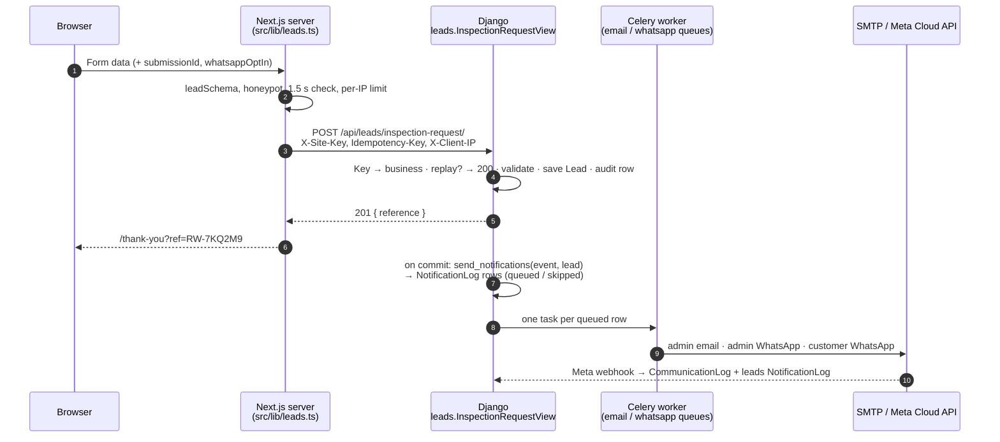
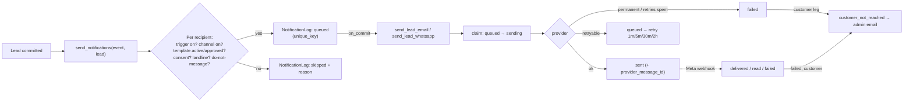

# API & Notification Architecture — Royal Waterproofing Co.

**What this covers:** the API the website calls, and the Email and WhatsApp notifications each enquiry sends.
**Status:** **implemented** in the ERP backend as the `leads` Django app (`construction-management-backend/apps/leads/`). It is not deployed yet: production needs the steps in [§5](#5-production-integration), and the website still has to switch from its stub to the API ([§5.5](#55-nextjs-integration)).
**Last updated:** 4 October 2026

---

## Contents

0. [What was built, and how it differs from the design](#0-what-was-built-and-how-it-differs-from-the-design)
1. [Implemented API architecture](#1-implemented-api-architecture)
2. [WhatsApp template architecture](#2-whatsapp-template-architecture)
3. [Email template architecture](#3-email-template-architecture)
4. [Celery architecture](#4-celery-architecture)
5. [Production integration](#5-production-integration)
6. [Models](#6-models)
7. [Code map](#7-code-map)
8. [Still open](#8-still-open)

---

## 0. What was built, and how it differs from the design

The website has one form that needs the API: the inspection request. "Get Free Inspection", "Request a Quote" and "Request a call back" all open it. After a lead is saved, Celery sends up to three messages: an email to the admin team, a WhatsApp message to the admin team, and a WhatsApp message to the customer, but only if they consented. Customers never get email. The chat assistant does not use this API.

### Where it lives

The ERP is a multi-tenant system. Its tenant root is a `Business`, and the website belongs to one of them. Everything is therefore scoped to a business:

| Design said | Built as | Why |
|---|---|---|
| `SITE_API_KEY` setting | A key **per business**, stored only as a SHA-256 hash on `LeadAdminProfile`. Issued by `manage.py setup_lead_notifications` or the admin action "Generate a new website API key" | The key is what tells Django which business a lead belongs to. A hash means a database leak does not leak the key. |
| `SITE_URL`, `LEAD_ALERT_EMAIL_FALLBACK`, business name in templates | Fields on `LeadAdminProfile` (`site_url`, `admin_email`, `display_name`, `inspection_label`, `reference_prefix`, `whatsapp_sender_number`) | Per-business details that admins can change without a deploy |
| `EMAIL_NOTIFICATIONS_ENABLED`, `ADMIN_BASE_URL` | `LEADS_EMAIL_ENABLED`, `LEADS_ADMIN_BASE_URL` | Renamed so a setting with a generic name cannot be mistaken for one that controls all ERP email |
| A new WhatsApp webhook | The **existing** webhook (`/api/notifications/whatsapp/webhook/`, same URL as the design) now sends a signal that `leads` listens to | Meta allows one webhook URL per app, and the ERP already had one for delivery receipts |
| `NotificationLog` holds everything | `leads.NotificationLog` is the outbox: whether a message goes, to whom, with what values, sent once. The shared `notifications.CommunicationLog` is the wire record: provider response and receipt timeline. They share `provider_message_id` | The ERP already records every email and WhatsApp message in `CommunicationLog`. Rebuilding that would duplicate it. |
| Events switched on implicitly | `NotificationTrigger` row per business + event (on/off) | The "admin details" model manages the triggers, templates and recipients that hang off it |

### Additions

- A `sending` status on `NotificationLog`. A worker claims a row before sending, which is what guarantees "never send twice" ([§4.5](#45-idempotency-and-duplicate-prevention)).
- `notification.customer_not_reached` is also raised when a customer message that was planned is skipped at send time, for example because WhatsApp was switched off between planning and sending. In that case the admin messages had already said "Sent on WhatsApp", so staff must be told otherwise.
- An Indian number with a `0`, `91` or `+91` prefix is stored as `91` plus 10 digits. Bare international digits from Meta (`971501234567`) are accepted on admin-entered numbers.

### Not built

| Item | Reason |
|---|---|
| API 3 — photo uploads | The design marks it "later". The website has `features.photoUploads = false` and there is no object storage in the backend yet. [§1.9](#19-api-3--photo-uploads-not-built) lists what it needs. |
| `inspection.booked`, `inspection.reminder`, `lead.waiting` | They need an inspection-booking step that doesn't exist yet. Adding one is the three steps in [§2.7](#27-adding-an-event-later). |
| A React (ERP frontend) screen for templates and leads | The design uses Django admin, so that is the UI built. No ERP endpoint was added for it. |
| Automatic submission of templates to Meta | The design's admin tools are preview, test send, sync status, resend and turn off. Templates are created in Meta Business Manager ([§5.3](#53-whatsapp-template-approval)). |

### Known limitation

The shared WhatsApp client (`notifications.whatsapp.normalize_phone`) treats any 10-digit number as Indian. A customer with an international number of 10 digits or fewer *including* the country code (Singapore `+65 9123 4567`, for example) is therefore **not** messaged. The reason is recorded as "number format not supported", and the admin messages say "please call". Fixing this means changing the shared client, which the ERP's billing, payroll and attendance messages also use, so it was left alone.

---

## 1. Implemented API architecture

### 1.1 Endpoints

| Method + URL | Purpose | Called by | Authentication |
|---|---|---|---|
| `POST /api/leads/inspection-request/` | Submit an inspection request | Next.js server only | `X-Site-Key` header |
| `GET /api/notifications/whatsapp/webhook/` | Meta's one-time subscription check (returns `hub.challenge`) | Meta | `hub.verify_token` = `WHATSAPP_WEBHOOK_VERIFY_TOKEN` |
| `POST /api/notifications/whatsapp/webhook/` | Delivery receipts, customer replies, template review results | Meta | `X-Hub-Signature-256` HMAC with `WHATSAPP_APP_SECRET`. Fails closed. |

There are no customer logins and no public read APIs. Staff work in Django admin at `/admin/` ([§6](#6-models)).

### 1.2 Authentication and permissions

| Who | Can do | How it is enforced |
|---|---|---|
| Website (Next.js server) | Create leads for **its** business | `SiteKeyAuthentication` hashes `X-Site-Key` and looks up the active `LeadAdminProfile`. A missing key returns **401**, and so does an unknown key, a switched-off profile or an inactive business. With no key issued, every request is refused. `request.auth` is the profile, and it scopes every write. |
| Meta | Webhook | Signature check in the existing `WhatsAppWebhookView`. Without `WHATSAPP_APP_SECRET`, every POST gets 403. |
| Staff: lead handlers | View and update leads, view message logs | Django group **Lead handlers** (`view_lead`, `change_lead`, `view_notificationlog`) |
| Staff: notification admins | Edit templates, triggers and recipients; sync with Meta; resend; manage the do-not-message list | Django group **Notification admins** |
| Superuser | Everything, including deleting a lead (data-removal requests) and adding profiles | `is_superuser` |

Both groups are created by `setup_lead_notifications`. Staff users also need `is_staff = True`. **In Django admin, a staff member who is not a superuser sees only rows of their own business** (`BusinessScopedAdmin`). Superusers see all businesses.

### 1.3 Request

**Headers**

| Header | Required | Rule | Missing or invalid |
|---|---|---|---|
| `X-Site-Key` | Yes | The business's website key (`lsk_…`) | 401 |
| `Idempotency-Key` | Yes | 8–64 characters of `A–Z a–z 0–9 _ -`. Use a UUID generated once per form. | 400 `{"errors": {"Idempotency-Key": [...]}}` |
| `X-Client-IP` | Yes | The visitor's IPv4/IPv6 address | 400 `{"errors": {"X-Client-IP": [...]}}` |
| `Content-Type` | Yes | `application/json` | 400/415 from DRF |

**Body** (example)

```json
{
  "name": "Priya Sharma",
  "phone": "98200 12345",
  "service": "bathroom-waterproofing",
  "serviceName": "Bathroom Waterproofing",
  "area": "other",
  "areaName": "Other",
  "areaOther": "Mira Road",
  "propertyType": "apartment",
  "email": "priya@example.com",
  "message": "Damp patch on the ceiling below our bathroom, worse since the monsoon.",
  "preferredDate": "2026-10-10",
  "timeWindow": "morning",
  "contactMethod": "whatsapp",
  "whatsappOptIn": true,
  "sourcePage": "/services/bathroom-waterproofing",
  "formLocation": "service-bathroom-waterproofing-cta",
  "attribution": { "utm_source": "google", "utm_medium": "cpc", "utm_campaign": "monsoon-2026" },
  "photoCount": 0
}
```

The short form may send only `name`, `phone`, `service` and `area`, plus `areaOther` when the area is `other`. Unknown fields such as `website` and `elapsedMs` are ignored.

### 1.4 Validation

The rules and messages match `leadSchema` in the website's `src/lib/validation.ts` word for word, so an error from Django looks the same as one from the browser. Keys are the website's camelCase field names. This deliberately departs from the ERP's usual snake_case, because the form puts each error under the field with the same name.

| Field | Rule | Message |
|---|---|---|
| `name` | 2–80 characters after trimming | "Please enter your name." / "Please keep your name under 80 characters." |
| `phone` | Required | "Please enter a phone number so we can call you back." |
| | Only digits, spaces, `-`, `(`, `)`, `.` and a leading `+` | "Use digits only — spaces, dashes and a leading + are fine." |
| | **Indian:** 10 digits starting 2–9, optionally written with `+91`, `91` or a leading `0`. **International:** starts with `+` (not `+91`), 8–15 digits | "Enter a 10-digit mobile number, or add your country code if you're outside India." |
| `service` | Required, max 80 | "Choose the service you need, or “Not sure”." |
| `area` | Required, max 80 | "Choose your area, or “Other”." |
| `areaOther` | Required when `area` is `other`; max 80 | "Tell us which area you're in." / "Please keep this under 80 characters." |
| `email` | Empty or a valid address (stored lower-case) | "Please enter a valid email address, or leave it blank." |
| `propertyType` | Empty or `apartment`, `society`, `house`, `commercial`, `industrial`, `new-build` | "Choose a property type." |
| `message` | Max 1,500 | "Please keep this under 1,500 characters." |
| `preferredDate` | Empty or `YYYY-MM-DD`, no earlier than yesterday (India time) | "Please choose today or a later date." |
| `timeWindow` | Empty or `morning`, `afternoon`, `evening` | "Choose one of the options." |
| `contactMethod` | Empty (→ `call`), `call` or `whatsapp` | "Choose one of the options." |
| `whatsappOptIn` | Boolean, default `false` | — |
| `photoCount` | 0–5, default 0 | "Up to 5 photos." |
| `serviceName`, `areaName` | Text, kept up to 120 characters | — |
| `sourcePage` / `formLocation` | Text, kept up to 200 / 80 characters | — |
| `attribution` | Only `utm_source`, `utm_medium`, `utm_campaign`, `utm_term`, `utm_content`, `landing_page`, `referrer` are kept; values cut to 200. Tracking data never fails a lead. | — |

**Set by Django:** `reference`, `status`, `phone_e164` (e.g. `919820012345`), `phone_type` (`india_mobile`: starts 6–9; `india_landline`: starts 2–5; `international`), `whatsapp_opt_in_at`, `ip_address`, `duplicate_of` and `created_at`.

### 1.5 Responses and error handling

| Status | Body | When | What the website shows |
|---|---|---|---|
| **201** | `{"reference": "RW-7KQ2M9", "message": "Thank you. We'll call you back to understand the problem and fix a visit time."}` | Lead saved | Thank-you page with the reference |
| **200** | Same body, **same reference** | `Idempotency-Key` already used for this business. Nothing is saved or sent again, and the body is not re-validated. | Thank-you page |
| **400** | `{"errors": {"phone": ["…"], "areaOther": ["…"]}}` | Validation or header problem | Each message under its field |
| **401** | `{"detail": "…"}` | Missing or wrong `X-Site-Key` | Generic error box (this is a configuration bug, not a visitor error) |
| **429** | `{"detail": "Request was throttled. Expected available in N seconds."}` | More than `LEADS_RATE_LIMIT` (default `10/hour`) from one visitor IP to one business | "You've sent a few requests already. Please call or WhatsApp us instead." |
| **500** | — | Anything else | "We couldn't send your request just now." with Call and WhatsApp buttons |

The reference is `<reference_prefix>-` plus 6 characters from `23456789ABCDEFGHJKLMNPQRSTUVWXYZ` (no 0/O or 1/I, so it can be read over the phone). It matches the thank-you page's `RW-[A-Z0-9]{3,12}` and is unique across the database. On the very rare collision Django draws again, up to 5 times.

Notifications run **after** the response is decided and the row is committed. A slow or failing email or WhatsApp provider can never fail or slow the form.

### 1.6 Integration flow



What happens inside `create_inspection_request`:

1. Look for an enquiry from the same `phone_e164` and business inside `LEAD_DUPLICATE_WINDOW_MINUTES` (default 30). If found, link to the *first* enquiry (`duplicate_of`) and set `status = duplicate`.
2. Draw a reference and run `full_clean()`.
3. In one transaction, save the `Lead`, write an audit row `LEAD_CREATE` (system actor) and register an on-commit callback.
4. After the commit, call `send_notifications("lead.created" | "lead.repeat_enquiry", lead)`. The callback is `robust`, so an error there is logged and never turns the 201 into a 500.
5. If two requests race with the same `Idempotency-Key`, the database's unique `(business, idempotency_key)` constraint makes the loser return the winner's lead with 200.

### 1.7 Duplicate enquiries

| Situation | Django does |
|---|---|
| Same `Idempotency-Key` (a retry) | Returns the first result with 200. Saves nothing and sends nothing. |
| Same phone, same business, within 30 minutes (a new form) | Saves it as `duplicate` of the first lead and raises `lead.repeat_enquiry`: admin email and admin WhatsApp only. The customer is not messaged twice. |
| Same phone, another business | Unrelated; a normal new lead |

### 1.8 API 2 — WhatsApp webhook

Meta sends every callback to the existing `WhatsAppWebhookView`. That view verifies the signature, applies receipts to `CommunicationLog` (unchanged behaviour), then sends `notifications.signals.whatsapp_webhook_received` with `send_robust`. The `leads` receiver checks whether the body concerns leads: a receipt for a known `provider_message_id`, an inbound message, or a template review. Only then does it queue `leads.tasks.process_whatsapp_webhook`. The view always returns 200 once the signature is valid.

| Update from Meta | Lead-side action |
|---|---|
| `sent` / `delivered` / `read` | Advance the `NotificationLog` row, forward-only: a late `delivered` never demotes `read`. Sets `delivered_at` / `read_at`; `read` implies delivered. |
| `failed` | Mark the row failed with Meta's code and reason. If it was the **customer** message, raise `notification.customer_not_reached`, which emails the admin "Couldn't reach … — please call". If the code is `131026` (not on WhatsApp), add the number to that business's do-not-message list. A redelivered `failed` changes nothing. |
| Customer replies `STOP` or `UNSUBSCRIBE` (any case) | Add the number to the do-not-message list of **every business holding a lead from that number**, and only those |
| `message_template_status_update` | Update `meta_status` (and reason, Meta id) on every template with that name and language |

A webhook can update rows only by Meta's globally unique message id or template name. It can never create a lead or reach a business by any tenant identifier.

### 1.9 API 3 — photo uploads (not built)

The design stays as it was: `POST /api/leads/uploads/` returns pre-signed `putUrl`s, the browser uploads to object storage, and API 1 accepts `photoIds`. It needs an object-storage decision (S3 or similar, plus `django-storages`) that the backend has not made. `Lead.photo_count` and `{{photo_count}}` are already in place. Until then customers send photos on WhatsApp.

---

## 2. WhatsApp template architecture

### 2.1 How it works

- The **wording lives at Meta**. Django sends only the template name, the language and the values in order.
- Each `NotificationTemplate` row (channel `whatsapp`) stores `meta_template_name`, `header_text`, `body_preview` (the body exactly as submitted to Meta), `footer_text` and `param_order`, the list of variable names behind `{{1}}`, `{{2}}`… It also stores `button_param` (the variable for a dynamic URL button's suffix) and `meta_status`.
- **`param_order` is load-bearing.** If it doesn't match the approved body, real values land in the wrong slots. Two safeguards protect it: a save checks that `param_order` has one name per numbered variable, and "Sync with Meta" compares Meta's approved body with `body_preview`. If they differ, the template stays `draft` and is not sent.
- Sending goes through the ERP's only Meta client, `notifications.whatsapp.send_template`. It builds the components, strips line breaks, never sends an empty value and records the `CommunicationLog` row.

### 2.2 Naming conventions

`<prefix>_<audience>_<purpose>`: lower-case, `a–z 0–9 _` only (Meta's rule). `<prefix>` is the business's `reference_prefix` in lower case (`rw`). `<audience>` is `admin` or `client`. Meta names cannot be changed once created, so a wording change keeps the name and re-enters review. A breaking change, such as different variables, gets a new name with a version suffix, e.g. `rw_client_enquiry_received_v2`.

### 2.3 Categories and types

All templates are **UTILITY** (a transactional reply to the customer's own request), language `en`, text header, text footer. The admin templates have one **dynamic URL button**; the customer template has no button. MARKETING is selectable in admin but none is used.

### 2.4 Dynamic variables

Variables come from `leads/events.py` and are filled by `leads/rendering.py`. A template may only use the variables registered for its event **and audience**. The customer audience gets a small set, so a customer message can never quote the admin link, phone numbers or tracking data.

| Variable | Example | Audience |
|---|---|---|
| `reference` | `RW-7KQ2M9` | all |
| `customer_first_name` | `Priya` | all |
| `service_phrase` | `bathroom waterproofing` (`not-sure` → `a leak or damp diagnosis`) | all |
| `area_display` | `Mira Road` (the typed area when the area is "Other") | all |
| `business_name` | `Royal Waterproofing Co.` (profile `display_name`) | all |
| `inspection_label` | `free site inspection` (profile) | all |
| `customer_name` | `Priya Sharma` | admin |
| `customer_phone` | `+91 98200 12345` | admin |
| `customer_whatsapp_link` | `https://wa.me/919820012345` (empty for landlines) | admin |
| `customer_email` | `priya@example.com` | admin |
| `service_name` | `Bathroom Waterproofing` (`not-sure` → `Not sure — needs diagnosis`) | admin |
| `property_type` | `Flat` | admin |
| `message` | full text | admin |
| `message_short` | one line, max 300 characters | admin |
| `preferred_visit` | `Sat, 10 Oct 2026 · Morning` | admin |
| `contact_method` | `Phone call` / `WhatsApp` | admin |
| `customer_whatsapp_status` | `Sent on WhatsApp` / `Not messaged (landline) — please call` | admin |
| `submitted_at` | `Sun, 4 Oct 2026, 11:42 AM` (`TIME_ZONE`, Asia/Kolkata) | admin |
| `source_url` | profile `site_url` + `sourcePage` | admin |
| `campaign` | `google / cpc / monsoon-2026` or `Direct` | admin |
| `admin_lead_url` | `LEADS_ADMIN_BASE_URL` + `/leads/lead/<id>/change/` | admin |
| `admin_lead_path` | `<id>/change/` (the button suffix) | admin |
| `photo_count` | `0` | admin |
| `original_reference` | the first enquiry's reference | admin, `lead.repeat_enquiry` only |
| `failure_reason` | `This number can't receive WhatsApp messages (…)` | admin, `notification.customer_not_reached` only |

**Empty values:** WhatsApp gets `Not given`, because Meta rejects empty parameters. Line breaks inside a value become spaces.

`customer_whatsapp_status` reasons, in the order they are checked: `WhatsApp is switched off`, `template not approved`, `no WhatsApp consent`, `landline`, `asked not to be messaged`, `repeat enquiry`, `number format not supported`.

### 2.5 Admin templates

**`rw_admin_new_lead`** · `lead.created` → admin · UTILITY · `en`

```
Header: New inspection request

Body:
New website enquiry {{1}} received on {{2}}.

Name: {{3}}
Phone: {{4}}
Service: {{5}}
Area: {{6}}
Preferred visit: {{7}}
Contact by: {{8}}
WhatsApp to customer: {{9}}

Message: {{10}}

Please call the customer back and update the lead in the admin panel.

Footer: Royal Waterproofing Co. website alert
Button (URL, dynamic): "Open lead" → https://<api-domain>/admin/leads/lead/{{1}}
```

`param_order`: `reference, submitted_at, customer_name, customer_phone, service_name, area_display, preferred_visit, contact_method, customer_whatsapp_status, message_short`. Button: `admin_lead_path`.

**`rw_admin_repeat_enquiry`** · `lead.repeat_enquiry` → admin · UTILITY · `en`

```
Header: Repeat enquiry

Body:
Repeat website enquiry {{1}} from {{2}}, who already enquired as {{3}} a few minutes ago.

Phone: {{4}}
Service: {{5}}
Area: {{6}}
Message: {{7}}

Please handle both requests in a single call.

Footer: Royal Waterproofing Co. website alert
Button (URL, dynamic): "Open lead" → https://<api-domain>/admin/leads/lead/{{1}}
```

`param_order`: `reference, customer_name, original_reference, customer_phone, service_name, area_display, message_short`. Button: `admin_lead_path`.

Admin WhatsApp goes to every active `NotificationRecipient` with channel `whatsapp` whose `events` list includes the event (an empty list means all events). The sending number (`whatsapp_sender_number`) is rejected as a recipient. If there are no recipients, a `skipped` log row says so.

### 2.6 Client templates

**`rw_client_enquiry_received`** · `lead.created` → customer · UTILITY · `en`

```
Header: Request received

Body:
Hello {{1}}, thank you for contacting {{2}}.

We have received your request for {{3}} in {{4}}.
Your reference is {{5}}.

Our team will call you to understand the problem and fix a time for your {{6}}. Please keep your reference handy when we call.

Footer: Royal Waterproofing Co. · Santacruz East, Mumbai
```

`param_order`: `customer_first_name, business_name, service_phrase, area_display, reference, inspection_label`. No button.

The seed sets the footer to the display name; change it in admin to match what you submit to Meta. Footers are not sent at send time, so a footer mismatch is cosmetic. **Kept out on purpose:** call-back times, "urgent leaks" and warranty wording. They are not confirmed (`pendingFacts` in the site's `src/config/site.ts`), and saving such wording in admin shows a warning.

The customer is messaged only when **all** of these hold: WhatsApp is configured, the template is `approved` and active, `whatsappOptIn` is true, the number is not an Indian landline, it is not on the business's do-not-message list, the lead is not a repeat enquiry, and the number is supported by the shared client ([§0](#known-limitation)).

### 2.7 Trigger and event mapping

| Event (code) | Raised by | Admin email | Admin WhatsApp | Customer WhatsApp |
|---|---|---|---|---|
| `lead.created` | New lead saved | ✅ admin email — new enquiry | ✅ `rw_admin_new_lead` | ✅ `rw_client_enquiry_received` (with consent) |
| `lead.repeat_enquiry` | Same phone within the window | ✅ admin email — repeat enquiry | ✅ `rw_admin_repeat_enquiry` | ❌ |
| `notification.customer_not_reached` | Customer WhatsApp failed (send error or Meta `failed` receipt), or was skipped at send time | ✅ admin email — customer not reached | ❌ | ❌ |

An event sends only if the business's `NotificationTrigger` for it is on. Each slot sends only if its template is active, and for WhatsApp, approved.

**Adding an event later** (e.g. `inspection.booked`):

1. Register it in `leads/events.py` with its deliveries and variables, and fill any new variables in `rendering.build_variables`.
2. Create its templates and trigger in Django admin. Submit WhatsApp templates to Meta.
3. Call `services.send_notifications("<event>", lead)` where it happens.

Sending, logging, retries, idempotency and the webhook don't change.

### 2.8 Meta rules enforced on save

`NotificationTemplate.clean()` (`leads/validators.py`) refuses to save a WhatsApp template that breaks any of these:

- Variables numbered `{{1}}…{{n}}` with no gaps, each used once. Named `{{variable}}` placeholders are not allowed in WhatsApp bodies.
- The body can't start or end with a variable, and two variables can't sit next to each other.
- No variables in the header or footer. Header max 60 characters, body max 1,024, footer max 60.
- `₹` is refused; write `INR`.
- `param_order` has exactly one registered name per numbered variable, and `button_param` is registered for the audience.

Warnings (the save still goes through): "code", "verify", "password" or "OTP", which can push Meta to the AUTHENTICATION category; and promises such as "within … hours", "warranty", "guarantee" or "24/7".

**Status lifecycle:** `draft` → `pending` → `approved` (or `rejected` / `paused` / `disabled`). Changing any wording field of a WhatsApp template bumps `version` and puts it back to **`draft`**, because Meta approved the old text. It is sent again only after Meta approval is recorded, by "Sync with Meta", by the template-status webhook, or by an admin setting `meta_status`. Log rows keep the `template_version` they were sent with.

### 2.9 WhatsApp provider integration requirements

| Requirement | Detail |
|---|---|
| Meta Cloud API app with a WhatsApp Business Account | `WHATSAPP_PHONE_NUMBER_ID` (sending), `WHATSAPP_BUSINESS_ACCOUNT_ID` (needed for "Sync with Meta") |
| Permanent system-user token | `WHATSAPP_ACCESS_TOKEN` with `whatsapp_business_messaging` and `whatsapp_business_management` |
| Webhook | Callback `https://<api-domain>/api/notifications/whatsapp/webhook/`, verify token `WHATSAPP_WEBHOOK_VERIFY_TOKEN`, app secret `WHATSAPP_APP_SECRET`. Subscribe to **`messages`** (receipts and STOP replies) and **`message_template_status_update`** (review results). |
| Switch | `WHATSAPP_ENABLED=true` only after the templates are approved. Until then every WhatsApp row is `skipped` with "WhatsApp is switched off", and the admin email tells staff to call. |
| Sending number | Recorded in the profile (`whatsapp_sender_number`) so it can't be added as an admin recipient |

---

## 3. Email template architecture

### 3.1 How it works

- The wording lives in the database (`NotificationTemplate`, channel `email`): `subject`, `body_text` and an optional `body_html`.
- Variables are written `{{customer_name}}` (spaces inside the braces are allowed). They are filled by **find-and-replace limited to the event's registered variables**. The Django template engine is never run on admin-editable text, because that would let template code run. An unregistered name is refused on save; if one slips through, it is left as typed, so the mistake is visible.
- Empty values become `—`. In `body_html` every value is HTML-escaped, and `body_text` is sent as plain text.
- The rendered subject and body are stored in `NotificationLog.content` when the message is planned. Retries and resends deliver exactly the planned text.
- Recipients: active email `NotificationRecipient`s for the event. If there are none, the profile's `admin_email`. **Reply-To** is the customer's email when they gave one, so staff can answer directly.
- Sent with `EmailMultiAlternatives` through the ERP's existing email stack. `settings.EMAIL_BACKEND` is the tracking backend, which records every email in `CommunicationLog`, and the actual SMTP/SES backend is `EMAIL_BACKEND` in `.env`. The sender is `DEFAULT_FROM_EMAIL`.

### 3.2 Admin email templates

**`lead.created` — new enquiry**

- Subject: `New inspection request {{reference}} — {{service_name}}, {{area_display}}`
- Body:

```
New inspection request from the website.

Reference: {{reference}}
Received: {{submitted_at}}

CUSTOMER
Name: {{customer_name}}
Phone: {{customer_phone}}
WhatsApp chat: {{customer_whatsapp_link}}
Email: {{customer_email}}
Prefers: {{contact_method}}
WhatsApp message to customer: {{customer_whatsapp_status}}

REQUEST
Service: {{service_name}}
Area: {{area_display}}
Property type: {{property_type}}
Preferred visit: {{preferred_visit}}
Photos: {{photo_count}}

Message:
{{message}}

SOURCE
Page: {{source_url}}
Campaign: {{campaign}}

Open in admin: {{admin_lead_url}}
```

**`lead.repeat_enquiry` — repeat enquiry**

- Subject: `Repeat enquiry {{reference}} from {{customer_name}} (already {{original_reference}})`
- Body: "{{customer_name}} already enquired as {{original_reference}} a few minutes ago. Please handle both requests in a single call.", followed by the reference, received time, name, phone, WhatsApp link, email, service, area, preferred visit, message and admin link.

**`notification.customer_not_reached` — customer not reached**

- Subject: `Couldn't reach {{customer_name}} on WhatsApp ({{reference}}) — please call`
- Body: "The WhatsApp message to {{customer_name}} about enquiry {{reference}} was not delivered.", then `Reason: {{failure_reason}}`, "Please call the customer instead.", the phone, service, area and received time, and the admin link.

Full default text: `apps/leads/defaults.py`. `setup_lead_notifications` creates it only where a template is missing and never overwrites an admin's edits.

### 3.3 Trigger mapping

See [§2.7](#27-trigger-and-event-mapping). Email is the only channel for `notification.customer_not_reached`, and the only admin channel that works before WhatsApp approval.

### 3.4 Celery delivery flow (email)

1. `send_notifications` writes a `queued` row with the rendered content, and after the commit calls `send_lead_email.delay(log_id)` on the `email` queue.
2. The worker **claims** the row (`queued` → `sending`, `attempts + 1`, in one `UPDATE`). If nothing is claimed, it returns.
3. It sends inside `communication_context(business, module="leads", target=lead)`, so the `CommunicationLog` row is attributed to the business and lead.
4. Success → `sent`. An `OSError` (SMTP fault, host down) → back to `queued` and retried. Any other error, such as a malformed header → `failed`, with no retry.

Admins check delivery in **Django admin → Notification logs** (one row per message) or the ERP's Audit → Communication log (wire-level, filter module `leads`).

---

## 4. Celery architecture

The existing Celery app (`erp/celery.py`), broker (Redis) and queues are reused. No new worker, queue or beat job was added.

### 4.1 Tasks

| Task | Queue | Enqueued by | Retries |
|---|---|---|---|
| `leads.tasks.send_lead_email` | `email` | `send_notifications` / `resend`, after commit | 4 (1 min, 5 min, 30 min, 2 h) on `OSError` |
| `leads.tasks.send_lead_whatsapp` | `whatsapp` | same | 4 (same schedule) on retryable errors ([§4.3](#43-failure-handling)) |
| `leads.tasks.process_whatsapp_webhook` | `default` | Webhook receiver, only for lead-related bodies | none (idempotent; Meta redelivers) |

Routes are in `CELERY_TASK_ROUTES`, and the `email`, `whatsapp` and `default` queues were already declared in `CELERY_TASK_QUEUES`. The `notifications.E001` system check fails `manage.py check` if a route ever points at an undeclared queue. Separate queues mean a WhatsApp outage does not hold up email.

### 4.2 Flow



### 4.3 Failure handling

| Failure | Outcome |
|---|---|
| Broker down when enqueuing | Row → `failed`, "Could not queue: …"; resend from admin once the broker is back. The lead itself is saved, and the 201 was already sent. |
| SMTP down or refused (`OSError`) | Retry 4 times, then `failed` |
| Other email error | `failed` at once |
| WhatsApp network error, HTTP 5xx or 429, or Meta codes `1, 2, 4, 17, 341, 80007, 130429, 131000, 131016, 131048, 131056, 133004` | Retry 4 times, then `failed` |
| Other Meta 4xx (e.g. `132001` template missing, `100` bad parameter) | `failed` at once; retrying cannot fix it |
| Meta code `131026` (undeliverable), at send or by webhook | `failed` + number added to the do-not-message list (`not_on_whatsapp`) |
| WhatsApp switched off or number unusable at send time | `skipped` with the reason |
| Customer WhatsApp ends `failed` or `skipped` at send | `notification.customer_not_reached` → admin email (once per lead) |
| Error while planning notifications | Logged (`robust` on-commit); the lead and the 201 are unaffected |
| Worker dies mid-send | Row stays `sending`. After 15 minutes it counts as stuck, and "Resend failed messages" accepts it. |

### 4.4 Logging and monitoring

- **`leads.NotificationLog`** (Django admin): one row per planned message, with status, reason, Meta error code, attempts and timestamps. Recipients are masked in lists. Filter by status, channel, audience and event. Row action **Resend failed messages** works only for `failed` or stuck rows; `skipped` rows have a rule behind them, such as no consent, and are never resent.
- **`notifications.CommunicationLog`** (ERP Audit → Communication log, or Django admin): wire-level request, provider response and receipt timeline, `module = leads`.
- **Audit log:** `LEAD_CREATE` for every lead, `LEAD_SITE_KEY_ROTATE` for every key rotation.
- **Python loggers:** `leads.services` and `leads.tasks` (attempt failures, queue failures), and `notifications.whatsapp` (Meta errors with the response body).
- **What to watch:** rows stuck in `queued` mean no worker is consuming the queue. A rising `failed` count on `whatsapp` means Meta credentials or template status are wrong. `skipped` with "template not approved" means sync with Meta.

### 4.5 Idempotency and duplicate prevention

| Layer | Prevents |
|---|---|
| `Idempotency-Key` → unique `(business, idempotency_key)` | A visitor retry creating a second lead or second set of messages |
| Repeat-enquiry window | A second customer WhatsApp for the same phone within 30 minutes |
| `NotificationLog.unique_key` = SHA-256(event, lead, audience, channel, recipient) | Planning the same event twice. `send_notifications` can be called again safely, and it queues nothing new. |
| Claim (`queued` → `sending` in one `UPDATE`) | Celery redelivery (`acks_late`), a duplicate enqueue or two workers sending one row |
| Forward-only receipt statuses | A late or duplicate Meta callback demoting or re-processing a row |
| `customer_not_reached` keyed like any other message | Two "please call" emails for one lead |

---

## 5. Production integration

### 5.1 Environment variables (Django)

**New:**

| Variable | Default | Purpose |
|---|---|---|
| `LEADS_EMAIL_ENABLED` | `true` | Switch for every lead email |
| `LEADS_ADMIN_BASE_URL` | empty | e.g. `https://<api-domain>/admin`. Builds "Open in admin" links; left empty, they show `—`. |
| `LEADS_RATE_LIMIT` | `10/hour` | Per visitor IP and business |
| `LEAD_DUPLICATE_WINDOW_MINUTES` | `30` | Repeat-enquiry window |

**Reused (already in `.env.example`):** `TIME_ZONE` (`Asia/Kolkata`), `DEFAULT_FROM_EMAIL`, `EMAIL_BACKEND`, `EMAIL_HOST`, `EMAIL_PORT`, `EMAIL_USE_TLS`, `EMAIL_HOST_USER`, `EMAIL_HOST_PASSWORD`, `WHATSAPP_ENABLED`, `WHATSAPP_API_URL`, `WHATSAPP_PHONE_NUMBER_ID`, `WHATSAPP_ACCESS_TOKEN`, `WHATSAPP_BUSINESS_ACCOUNT_ID`, `WHATSAPP_LANGUAGE_CODE`, `WHATSAPP_DEFAULT_COUNTRY_CODE`, `WHATSAPP_WEBHOOK_VERIFY_TOKEN`, `WHATSAPP_APP_SECRET`, `CELERY_BROKER_URL`, `CELERY_RESULT_BACKEND`, `CACHE_URL` (throttle counters; must be shared Redis in production).

**Per business, in the database** (`setup_lead_notifications` or Django admin): the website key, display name, site URL, fallback admin email, sending number, reference prefix, inspection label, triggers, templates and recipients.

### 5.2 Provider configuration

- **Email:** nothing new. The ERP's SMTP or Amazon SES settings apply (`apps/notifications/README.md`). `DEFAULT_FROM_EMAIL` must be on a domain with **SPF and DKIM** (and ideally DMARC), or alerts land in spam.
- **WhatsApp:** as in [§2.9](#29-whatsapp-provider-integration-requirements). Use the same Meta app the ERP already uses; there is still one webhook URL.

### 5.3 WhatsApp template approval

1. In Meta Business Manager → WhatsApp Manager → Message templates, create each template in [§2.5](#25-admin-templates)–[§2.6](#26-client-templates) **exactly** as written: name, category UTILITY, language English (`en`), header, body, footer. For the admin templates, add a URL button "Open lead" with a dynamic suffix (`https://<api-domain>/admin/leads/lead/{{1}}`).
2. Give realistic example values for every `{{n}}`, or Meta rejects the template for missing examples.
3. Copy the submitted body into the template's `body_preview` in Django admin if you changed anything, and keep `param_order` matching.
4. After approval (usually minutes to a day), select the templates in admin → **Sync with Meta**, or let the `message_template_status_update` webhook do it. Status must read `approved`.
5. Any later wording change goes through review again; the admin save puts the template back to `draft` automatically.

### 5.4 Deployment steps

1. Deploy the backend with `apps/leads` (it is in `INSTALLED_APPS`, URLs are mounted).
2. `python manage.py migrate` applies `leads.0001_initial`.
3. `python manage.py check`: must report no issues. `notifications.E001` guards the queue routes.
4. Restart the Celery **worker** so it imports `leads.tasks`. A plain `celery -A erp worker -l info` consumes `default`, `email` and `whatsapp`. Beat needs no change.
5. Set up the business:

   ```bash
   python manage.py setup_lead_notifications --business "<business name or slug>" \
     --display-name "Royal Waterproofing Co." \
     --site-url https://royalwaterproofingco.com \
     --admin-email info@royalwaterproofingco.com \
     --sender-number "+91 97020 08187" \
     --admin-whatsapp "+91 <staff number>"
   ```

   Copy the printed `lsk_…` key into the website's `LEADS_API_KEY`. It is shown once; `--rotate-key` issues a new one and retires the old one immediately.
6. Set `LEADS_ADMIN_BASE_URL`. Add email recipients in admin (otherwise alerts go to the profile's admin email).
7. Create staff logins (`is_staff`) and add them to **Lead handlers** or **Notification admins**.
8. Leave `WHATSAPP_ENABLED=false` until [§5.3](#53-whatsapp-template-approval) is done; emails work without it.
9. Point the website at the API ([§5.5](#55-nextjs-integration)), then run the checklist ([§5.8](#58-production-verification-checklist)).

### 5.5 Next.js integration

The website repo (`royal-waterproofing-web`) was **not changed**. These are the changes it needs.

**Server-only env** (add to `.env.example`):

| Variable | Purpose |
|---|---|
| `LEADS_API_URL` | e.g. `https://api.example.com/api`. **Empty keeps today's stub behaviour**, so local development and e2e tests don't need Django. |
| `LEADS_API_KEY` | The `lsk_…` key from step 5 |
| `LEADS_API_TIMEOUT_MS` | Default `8000` |

**Form and schema changes:**

1. Add an **unticked** checkbox "Send me updates about this request on WhatsApp" to both form versions → `whatsappOptIn` (boolean) in `leadSchema`. Choosing WhatsApp as the contact method is not consent.
2. Generate a `submissionId` (`crypto.randomUUID()`) **once per form mount**, send it with the form, and reuse it on retries.
3. Send `serviceName`, `areaName` (looked up from site content) and `formLocation`.
4. Add a per-IP limit to the Server Action (copy `src/lib/chat/rate-limit.ts`).
5. Update the privacy policy: email and WhatsApp (Meta) as processors, WhatsApp consent and how to stop it (reply STOP), and retention.

**`src/lib/leads.ts`** (the only file that calls Django). A reference implementation:

```ts
import "server-only";
import { headers } from "next/headers";
import type { Lead, LeadResult } from "@/lib/validation";

const SERVER_ERROR = "We couldn't send your request just now.";
const RATE_LIMITED = "You've sent a few requests already. Please call or WhatsApp us instead.";

export async function submitLead(lead: Lead & { submissionId: string }): Promise<LeadResult> {
  // Bot checks stay first, unchanged (honeypot / elapsedMs → fake success).

  const base = process.env.LEADS_API_URL;
  if (!base) return stubSubmit(lead); // today's behaviour, for dev and e2e

  const h = await headers();
  const clientIp = (h.get("x-forwarded-for") ?? "").split(",")[0].trim() || h.get("x-real-ip") || "";
  const { website, elapsedMs, submissionId, ...body } = lead; // never forward bot fields

  let response: Response;
  try {
    response = await fetch(`${base}/leads/inspection-request/`, {
      method: "POST",
      headers: {
        "Content-Type": "application/json",
        "X-Site-Key": process.env.LEADS_API_KEY ?? "",
        "Idempotency-Key": submissionId,
        "X-Client-IP": clientIp,
      },
      body: JSON.stringify(body),
      signal: AbortSignal.timeout(Number(process.env.LEADS_API_TIMEOUT_MS ?? 8000)),
      cache: "no-store",
    });
  } catch {
    return { ok: false, error: "server", message: SERVER_ERROR }; // timeout or network
  }

  if (response.status === 201 || response.status === 200) {
    const data = await response.json();
    return { ok: true, reference: data.reference };
  }
  if (response.status === 400) {
    const data = await response.json().catch(() => ({}));
    return { ok: false, error: "validation", message: "Please check the highlighted fields.", fieldErrors: data.errors };
  }
  if (response.status === 429) return { ok: false, error: "server", message: RATE_LIMITED };
  return { ok: false, error: "server", message: SERVER_ERROR }; // 401 is a config bug: log it server-side
}
```

`X-Client-IP` must be the real visitor IP. Behind a proxy, read it from the header your host sets, and make sure visitors can't spoof it (on Vercel, `x-forwarded-for` is set by the platform). A missing or invalid IP is rejected with 400 rather than putting every visitor into one rate-limit bucket.

### 5.6 Database migration requirements

- One additive migration, `leads/migrations/0001_initial.py`: 7 new tables, no change to any existing table.
- Uses UUID primary keys, a JSON column and a **partial index** (`provider_message_id <> ''`), all supported on PostgreSQL. Verified here on SQLite (test suite + a migrated copy of the dev database); **not yet run on PostgreSQL**, so apply it on staging first.
- Deleting a business cascades to its profile, leads and logs. Deleting a lead (superuser only, for data-removal requests) cascades to its log rows. `CommunicationLog` rows are kept, per the existing retention job (`COMMUNICATION_LOG_RETENTION_DAYS`).

### 5.7 Celery worker and beat requirements

- **Worker:** must consume `default`, `email` and `whatsapp`. The plain `celery -A erp worker -l info` does, because `CELERY_TASK_QUEUES` declares them. Restart it after deploying. To isolate, you may run a dedicated worker per queue (`-Q email`, `-Q whatsapp`), but every queue must have a consumer.
- **Beat:** no new schedule. Template status updates come by webhook, plus the manual "Sync with Meta" action.
- **Broker/cache:** Redis, as today. `CACHE_URL` must be shared, because the API rate limit counts there.
- **Do not** set `CELERY_TASK_ALWAYS_EAGER=true` in production; sends would run inside the web request.

### 5.8 Production verification checklist

- [ ] `manage.py migrate` applied `leads.0001_initial`; `manage.py check` is clean
- [ ] Worker restarted; its startup banner lists `leads.tasks.send_lead_email`, `send_lead_whatsapp` and `process_whatsapp_webhook`, and the queues `default`, `email` and `whatsapp`
- [ ] `setup_lead_notifications` ran; the key is set in Next.js; `LEADS_ADMIN_BASE_URL` is set
- [ ] `curl` without `X-Site-Key` → **401**; with a wrong key → **401**
- [ ] A test submission from the live form → thank-you page with an `RW-` reference; the lead appears in Django admin
- [ ] Resubmitting the same request (same `submissionId`) → same reference, no second lead, no second email
- [ ] Admin email arrives: from `DEFAULT_FROM_EMAIL`, Reply-To the test email, not in spam, "Open in admin" link works
- [ ] Notification log shows `admin/email: sent`; Communication log shows the email under module `leads`
- [ ] Templates show `approved` after Sync with Meta, then `WHATSAPP_ENABLED=true`
- [ ] Test with consent from a real mobile → admin and customer WhatsApp arrive; status moves to `delivered` / `read` (webhook working)
- [ ] Test without consent → customer row `skipped`, "no WhatsApp consent"; the admin messages say "please call"
- [ ] Same phone again within 30 minutes → `duplicate` lead, admin-only messages
- [ ] Reply "STOP" from the test phone → the number appears in the do-not-message list
- [ ] 11 rapid submissions from one IP → the 11th gets 429 and the website shows the rate-limit message
- [ ] "Send test to me" on each template delivers to your own email or phone
- [ ] Privacy policy updated before WhatsApp goes live

---

## 6. Models

All in `apps/leads/models.py`; every row belongs to one business, directly or through its profile.

| Model | Key fields | Notes |
|---|---|---|
| `LeadAdminProfile` | `business` (one-to-one), `display_name`, `site_url`, `admin_email`, `whatsapp_sender_number`, `reference_prefix`, `inspection_label`, `api_key_hash`/`api_key_prefix`/`api_key_rotated_at`, `is_active` | The admin details. Off refuses the website's key. |
| `NotificationTrigger` | `profile`, `event`, `is_active` | One per event; no row means off |
| `NotificationTemplate` | `profile`, `event`, `audience`, `channel`, `language`, `is_active`; email: `subject`, `body_text`, `body_html`; WhatsApp: `meta_template_name`, `meta_category`, `header_text`, `body_preview`, `footer_text`, `param_order`, `button_param`, `meta_status`, `meta_status_reason`, `meta_template_id`, `meta_synced_at`; `version`, `updated_by` | Unique per profile + event + audience + channel + language |
| `NotificationRecipient` | `profile`, `name`, `channel`, `address` (email, or E.164 digits), `events` (empty = all), `is_active` | Admin team only |
| `Lead` | `reference` (unique), `status` (`new`/`contacted`/`closed`/`duplicate`), form fields, `phone_raw`/`phone_e164`/`phone_type`, `whatsapp_opt_in`/`_at`, `source_page`, `form_location`, `attribution`, `photo_count`, `idempotency_key` (unique per business), `duplicate_of`, `ip_address` | `ip_address` is never placed in a message |
| `NotificationLog` | `lead`, `event`, `audience`, `channel`, `recipient`, `template`, `template_version`, `content`, `status` (`queued`/`sending`/`sent`/`delivered`/`read`/`failed`/`skipped`), `reason`, `error_code`, `provider_message_id`, `attempts`, `unique_key`, `sent_at`/`delivered_at`/`read_at`/`failed_at` | The outbox |
| `WhatsAppDoNotMessage` | `business`, `phone_e164`, `reason` (`replied_stop`/`not_on_whatsapp`/`added_by_admin`) | Unique per business + phone |

**Django admin tools:** template **preview** with sample data, **Send test to me**, **Sync approval status with Meta**, **Turn on/off**; notification log **Resend failed messages**; profile **Generate a new website API key**; triggers and recipients edited inline on the profile.

---

## 7. Code map

```
construction-management-backend/
  apps/leads/
    events.py          # event registry: deliveries + allowed variables per audience
    validators.py      # phone parsing (mirrors the website), Meta/email template rules
    rendering.py       # lead → variables; safe find-and-replace; WhatsApp values
    models.py          # the seven models in §6
    selectors.py       # business-scoped reads
    services.py        # create lead, send_notifications, delivery, webhook, admin tools
    tasks.py           # send_lead_email, send_lead_whatsapp, process_whatsapp_webhook
    receivers.py       # subscribes to the shared webhook signal
    authentication.py  # X-Site-Key auth, X-Client-IP throttle
    serializers.py     # request validation (website field names and messages)
    views.py, urls.py  # POST /api/leads/inspection-request/
    admin.py           # Django admin + tools, business-scoped
    defaults.py        # starting wording (this document's §2.5–2.6, §3.2)
    management/commands/setup_lead_notifications.py
    tests/             # 62 tests: API, pipeline, retries, webhook, templates, admin, command
```

**Changes outside the new app**, all additive:

| File | Change |
|---|---|
| `erp/settings.py` | `"leads"` in `INSTALLED_APPS`; two `CELERY_TASK_ROUTES` entries (existing queues); the four `LEADS_*` / `LEAD_*` settings |
| `erp/urls.py` | One `include` for `leads.urls` under `/api/` |
| `apps/notifications/signals.py` (new) | `whatsapp_webhook_received` signal |
| `apps/notifications/views.py` | The webhook sends that signal after applying receipts (`send_robust`); its response and receipt handling are unchanged |
| `.env.example` | The `LEADS_*` block |
| `docs/website-leads.md` (new), `docs/audit-communication-logs.md` | API reference, and a note on the webhook signal |

---

## 8. Still open

**Questions for the business owner** (unchanged from the design):

| # | Question | Why it matters |
|---|---|---|
| 1 | Which number sends WhatsApp messages? Can +91 97020 08187 be connected to the Cloud API while staff keep using it in the WhatsApp Business app (Meta "coexistence")? | If another number sends, customer replies with photos go to a number nobody reads. Then add a "Send photos" button linking to `wa.me/919702008187`. |
| 2 | Who gets the admin alerts? Email addresses and staff WhatsApp numbers. | Admin WhatsApp needs at least one number, and it can't be the sending number. |
| 3 | Can messages promise a call-back time or urgent-leak calls? | Not confirmed, so the templates leave them out (and the admin warns). |
| 4 | How long should enquiries be kept? | Privacy policy; there is no automatic lead deletion yet. |

**Engineering follow-ups:**

- Run `leads.0001_initial` on staging PostgreSQL before production.
- Make the website changes in [§5.5](#55-nextjs-integration).
- Photo uploads (API 3) once object storage is chosen.
- Short international numbers ([§0](#known-limitation)) need a change to the shared WhatsApp client.
- Lead retention: a scheduled clean-up once the period in question 4 is decided.
